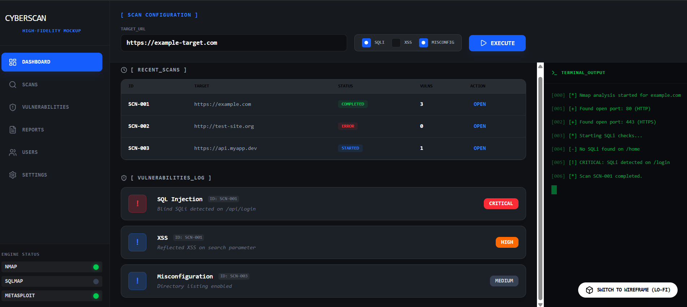
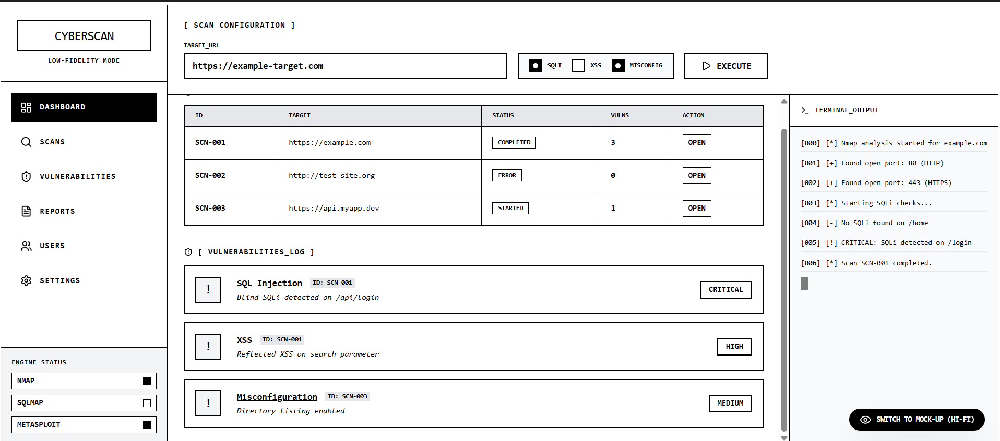

# Siber Savaşçılar: Otomatik Sızma Testi Aracı - Arayüz ve Veritabanı Entegrasyon Raporu

**Hazırlayan:** MUHAMMED BAKİ BAŞBAY

Bu doküman, "Siber Savaşçılar" sızma testi aracının kullanıcı arayüzü (UI) tasarımlarını (Wireframe ve Mockup) ve bu arayüzün arka plandaki veritabanı mimarisiyle nasıl entegre çalıştığını detaylandırmaktadır. 

## 1. Mimari ve Teknoloji Yığını
Arayüz tasarımı, arka planda çalışacak Python tabanlı tarama motorlarına (Nmap, SQLMap, Metasploit) ve veritabanı altyapısına doğrudan hizmet edecek şekilde kurgulanmıştır. Karmaşık güvenlik araçlarının tek bir merkezden, web tabanlı bir panel ile yönetilmesi hedeflenmiştir.

## 2. Veritabanı ve Arayüz (UI) Eşleşmesi
Hazırlanan arayüz, sistemde kurgulanan temel veritabanı tablolarına teknik olarak birebir bağlıdır ve veri akışını şu şekilde sağlar:

* **SCAN_CONFIGS (Tarama Yapılandırması):** Arayüzün üst kısmındaki "Scan Configuration" panelidir. Hedef URL'nin (`target_url`) girildiği ve SQL Injection, XSS, Hatalı Yapılandırma (`check_sqli`, `check_xss`, `check_misconfig`) gibi spesifik tarama motoru parametrelerinin belirlendiği kontrol noktasıdır.
* **SCANS (Tarama Takip Sistemi):** Arayüzün merkezindeki "Recent Scans" tablosudur. Veritabanındaki `status` (Completed/Error/Started) ve zaman damgaları (`started_at`, `finished_at`) verilerini çekerek, operasyonel süreçleri anlık olarak listeler.
* **VULNERABILITIES (Zafiyet Analiz Paneli):** Ekranın alt kısmında yer alan log modülüdür. Taramalar sonucunda elde edilen açıkları türlerine (`vuln_type`) ve kritiklik seviyelerine (`severity`: Critical, High, Medium) göre sınıflandırarak raporlama için önizleme sunar.
* **USERS (Kullanıcı Yönetimi):** Sol navigasyon menüsündeki "Users" sekmesi üzerinden erişilen, sisteme giriş yapan uzmanların yetki (`role`) ve erişim izinlerinin yönetildiği tablodur.

## 3. Arayüz Tasarım Görselleri
Aşağıda projenin yapısal iskeletini gösteren Wireframe (Low-Fidelity) ve son kullanıcı deneyimine hazır halini gösteren Mockup (High-Fidelity) tasarımları yer almaktadır.

### High-Fidelity Mockup (Renkli Tasarım)

### Low-Fidelity Wireframe (Siyah-Beyaz Tasarım)

